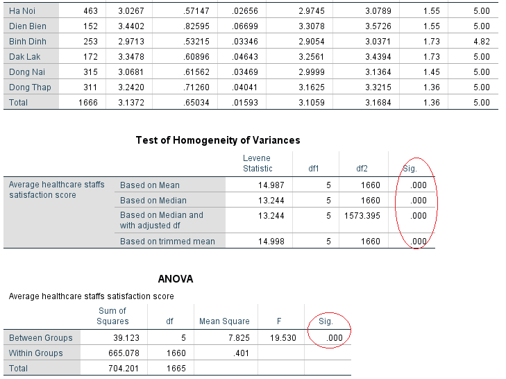
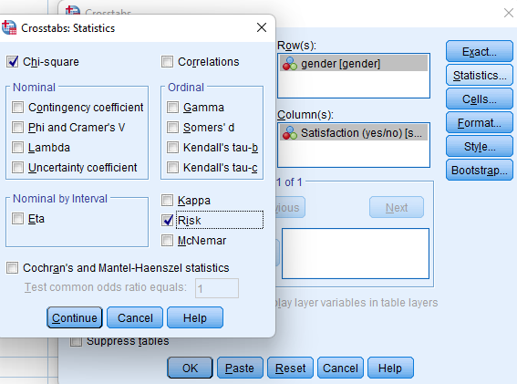
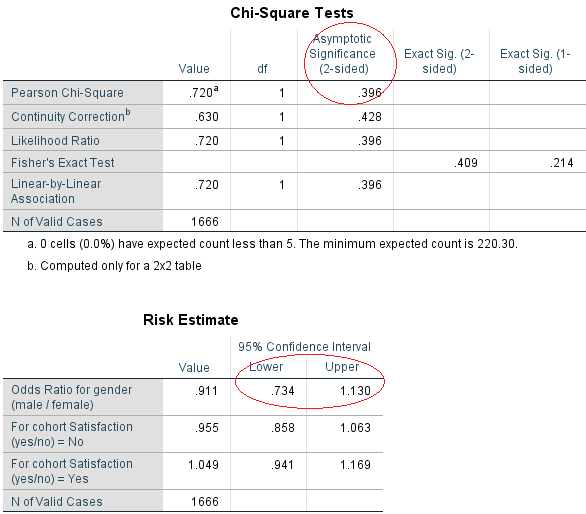
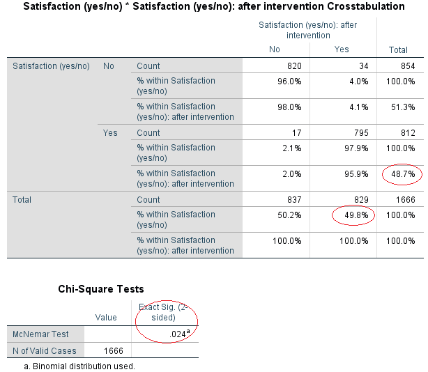
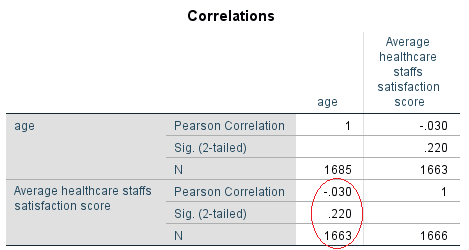

# Tóm tắt ứng dụng của SPSS

> Thống kê SPSS là một gói phần mềm được sử dụng để phân tích thống kê theo lô và theo lô có tính logic. Được sản xuất từ lâu bởi SPSS Inc. và được tập đoàn IBM mua lại năm 2009. Phiên bản hiện hành được đặt tên chính thức là IBM SPSS Statistics.

> Tài liệu được viết bởi *Long Nhật Nguyễn*.

## 1. Thống kê mô tả

> Các phần tiếp theo lấy dữ liệu từ [Nghiên cứu tăng huyết áp](../du-lieu/so-lieu-nghien-cuu-tang-huyet-ap.sav).

### 1.1. Mô tả một biến đơn thuần

#### 1.1.1. Mô tả một biến định tính

a. Giá trị thống kê cần mô tả

- Tần số (`Frequency`), tỷ lệ (`Percent` hoặc `Valid Percent` nếu có giá trị `missing` trong bảng tần số). Có thể miêu tả giá trị lớn nhất (`Max`), giá trị nhỏ nhất (`Min`).

b. Biểu đồ

- Cột rời (`Bar`).
- Hình tròn (`Pie`).

c. Lệnh SPSS

- `Analyse > Descriptive Statistics > Frequencies`. _Đảm bảo có tùy chọn bảng phân bố tần số `Display frequency table`_. Sử dụng `Charts` chọn biểu đồ cần vẽ.

#### 1.1.2. Mô tả một biến định lượng

a. Đánh giá một phân phối có là phân phối chuẩn hoặc sấp sỉ không?

- Giá trị trung bình có nằm trong 10% giá trị trung vị không?
- Giá trị trung bình ±3sd có xấp xỉ giá trị cực đại và cực
  tiểu trong bộ số liệu không?
- Hệ số Skewness có nằm trong ±3sd không?
- Hệ số Kurtosis có nằm trong ±3sd không?
- Biểu đồ cột liên tục có xuất phát điểm thấp, cao nhất ở giữa sau đó thấp dần về phía xa (không cần thiết phải theo đúng hình chuông) không?

b. Giá trị thống kê cần mô tả

- Đối với phân phối chuẩn hoặc gần chuẩn: Trung bình (`Mean`), độ lệch chuẩn (`Standard deviation - SD`), phân vị (`Interquartile`), giá trị lớn nhất (`Max`), giá trị nhỏ nhất (`Min`).
- Đối với phân phối không chuẩn: Trung vị (`Median`), khoảng phân vị (`IQR`), giá trị lớn nhất (`Max`), giá trị nhỏ nhất (`Min`).

c. Biểu đồ

- `Histograms`.
- `Boxplot`.

d. Lệnh SPSS

- `Analyse > Descriptive Statistics > Frequencies`. _Không sử dụng tùy chọn bảng phân bố tần số `Display frequency table`_. `Statistics` chọn các thống kê mô tả cần thiết. `Charts` chọn biểu đồ `Histograms`.

### 1.2. Mô tả hai biến

#### 1.2.1. Một biến định tính và một biến định lượng

a. Giá trị thống kê cần mô tả

- Đối với phân phối chuẩn hoặc gần chuẩn: Trung bình (`Mean`), độ lệch chuẩn (`Standard deviation - SD`), phân vị (`Interquartile`), giá trị lớn nhất (`Max`), giá trị nhỏ nhất (`Min`).
- Đối với phân phối không chuẩn: Trung vị (`Median`), khoảng phân vị (`IQR`), giá trị lớn nhất (`Max`), giá trị nhỏ nhất (`Min`).

b. Biểu đồ

- `Boxplot`.

c. Lệnh SPSS

- `Analyze > Reports > Case Summaries`. `Statistics` chọn các thống kê mô tả cần thiết.

- `Graphs > Legacy Dialogs > Boxplot`.

#### 1.2.2. Hai biến định tính

a. Giá trị thống kê cần mô tả

- Tần số (`Frequency`), tỷ lệ (`Percent`).

b. Biểu đồ

- `Bar` hoặc `Stacked`.

c. Lệnh SPSS

- `Analyze > Descriptive Statistics > Crosstabs`. `Cell` chọn tỷ lệ theo dòng (`Row`).

- `Graphs > Legacy Dialogs > Bar... > Stacked`.

#### 1.2.3. Hai biến định lượng

a. Giá trị thống kê cần mô tả

- Hệ số tương quan. Nếu hai biến xấp xỉ chuẩn chọn hệ số `Pearson`, nếu một biến xấp xỉ chuẩn chọn `Spearman`.

b. Biểu đồ

- `Scatterplot`.

c. Lệnh SPSS

- `Analyze > Correlate > Bivariate`. `Statistics` chọn các thống kê mô tả cần thiết.

- `Graphs > Legacy Dialogs > Scatter/Dot... > Simple Scatter`.

## 2. Thống kê phân tích

> Các phần tiếp theo lấy dữ liệu từ [Bộ số liệu được trích từ Điều tra y tế tuyến huyện, xã năm 2015](../du-lieu/staff-satisfaction.sav).

### 2.1. Một số kiến thức cơ bản về thống kê phân tích

a. Phân biệt biến

- Biến độc lập thường là biến có trước, biến phụ thuộc là biến có sau.

b. Các bước tiến hành kiểm định giả thiết

1. Hình thành giả thuyết (_Ho không có sự khác biệt vs. Ha có sự khác biệt_).
2. Xác định ý nghĩa thống kê (a = 0.05 và p = probability. Nếu _p < 0.05 = Bác bỏ Ho = Chấp nhận Ha = Kết quả xảy ra là chắn chắn = Khác biệt là có ý nghĩa thống kê_).
3. Xác định kiểm định thống kê.
4. Thực hiện kiểm định để tính p.
5. Phiên giải và kết luận.

c. Tỷ số chênh (OR), nguy cơ tương đối (RR)

- OR và RR:
  - OR > 1 yếu tố nguy cơ.
  - OR = 1 không liên quan.
  - OR < 1 yếu tố bảo vệ.
- CI không chứa 1 thì có ý nghĩa thống kê.
- OR sử dụng cho bảng 2x2 (hai nhóm). p < 0.05 thì OR có ý nghĩa. Khi p < 0.05 nhận xét thêm CI.

### 2.2. Kiểm định giá trị trung bình

#### 2.2.1. Kiểm định giả thiết cho một giá trị trung bình

- Ví dụ: _Trung bình điểm hài lòng của cán bộ y tế có khác 3.5 điểm không?_
- Giả thiết: _Ho là tương đương (không có sự khác biệt hay không có ý nghĩa thống kê) vs. Ha là không tương đương_.
- Lệnh SPSS: `Analyze > Compare Means > One-Sample T Test`.

- Kết quả:

- Kết luận: _Có sự khác biệt giữa điểm trung bình hài lòng của cán bộ y tế trong nghiên cứu năm 2015 với 3,5 điểm p = `Sig. (2-tailed)` = .000 < 0.05. Có ý nghĩa thống kê. Điểm trung bình hài lòng trong nghiên cứu năm 2015 thấp hơn khoảng 0.36282 điểm (CI95%: 0.3316-0.3941)._

#### 2.2.2. Kiểm định giả thiết cho hai giá trị trung bình

a. Với hai giá trị trung bình độc lập

- Ví dụ: _Điểm trung bình hài lòng của cán bộ y tế nam và nữ có khác nhau không?_
- Giả thiết: _Ho là tương đương (không có sự khác biệt hay không có ý nghĩa thống kê) vs. Ha là không tương đương_.
- Lệnh SPSS: `Analyze > Compare Means > IndependentSamples T Test`.

- Kết quả:

- Kết luận: _Không có sự khác biệt giữa điểm trung bình hài lòng giữa cán bộ y tế nam và nữ p = `Sig. (2-tailed)` = .057 > 0.05. Không có ý nghĩa thống kê._

b. Với hai giá trị trung bình ghép cặp

- Ví dụ: _Điểm trung bình hài lòng của cán bộ y tế sau 1 năm can thiệp?_
- Giả thiết: _Ho là tương đương (không có sự khác biệt hay không có ý nghĩa thống kê) vs. Ha là không tương đương_.
- Lệnh SPSS: `Analyze > Compare Means > Paired-Samples T Test`.

- Kết quả:

- Kết luận: _Có sự khác biệt về điểm trung bình hài lòng của cán bộ y tế trước và sau can thiệp p = `Sig. (2-tailed)` = .000 < 0.05. Có ý nghĩa thống kê. Trung bình điểm hài lòng của cán bộ y tế tăng khoảng 0.32587 điểm sau can thiệp (CI95%: 0.32082-0.33092)._

#### 2.2.3. Kiểm định cho nhiều giá trị trung bình

- Ví dụ: _Điểm trung bình hài lòng của cán bộ y tế trên 6 tỉnh thành có giống nhau không?_
- Giả thiết: _Ho là tương đương (không có sự khác biệt hay không có ý nghĩa thống kê) vs. Ha là không tương đương_.
- Lệnh SPSS: `Analyze > Compare Means > One-Way ANOVA`. `Options` chọn `Descriptive` và `Homogeneity of variance test`. `Post Hoc...` để so sánh từng cặp.

- Kết quả:

- Kết luận: _Có ít nhất hai tỉnh khác biệt về điểm trung bình hài lòng của cán bộ y tế p = `Sig.` = .000 < 0.05._

### 2.3. Kiểm định giá trị tỷ lệ

#### 2.3.1. Kiểm định giả thiết cho một giá trị tỷ lệ

- Ví dụ: _Tỷ lệ cán bộ y tế hài lòng với công việc có khác 70% không?_
- Giả thiết: _Ho là tương đương (không có sự khác biệt hay không có ý nghĩa thống kê) vs. Ha là không tương đương_.
- Lệnh SPSS: `Analyze > Nonparametric Tests > Legacy Dialogs > Binomial`.

- Kết quả:

- Kết luận: _Có sự khác biệt về tỷ lệ cán bộ y tế hài lòng với công việc với p = `Sig. (1-tailed)` = .000 < 0.05, tỷ lệ hài lòng của quần thể cán bộ y tế (`.5`) trong nghiên cứu năm 2015 thấp hơn 70%._

#### 2.3.2. Kiểm định giả thiết cho hai giá trị tỷ lệ độc lập

- Ví dụ: _Tỷ lệ cán bộ y tế hài lòng với công việc ở nam và nữ là như nhau?_
- Giả thiết: _Ho là tương đương (không có sự khác biệt hay không có ý nghĩa thống kê) vs. Ha là không tương đương_.
- Lệnh SPSS: `Analyze > Descriptive statistics > Crosstabs`. Chọn `Statistics...` chọn `Chi-square` và `Risk`. Lưu ý `Row(s)` chọn biến độc lập, `Column(s)` chọn biến phụ thuộc.

- Kết quả:

- Kết luận: _Theo `Pearson Chi-square` có p = `Asymptotic Significance (2-sided)` = .396 > 0.05 nên không có sự khác biệt tỷ lệ hài lòng ở cán bộ y tế nam và nữ. CI95% của OR (`Odds Ratio for gender (male/female)`) từ .734 đến 1.130 chứa giá trị 1 nên không có mối liên quan._

#### 2.3.3. Kiểm định giả thiết cho hai giá trị tỷ lệ ghép cặp

- Ví dụ: _Tỷ lệ cán bộ y tế hài lòng với công việc ở trước và sau can thiệp là như nhau?_
- Giả thiết: _Ho là tương đương (không có sự khác biệt hay không có ý nghĩa thống kê) vs. Ha là không tương đương_.
- Lệnh SPSS: `Analyze > Descriptive statistics > Crosstabs`. Chọn `Statistics...` chọn `McNemar`. Chọn `Cells` mục `Percentages` chọn `Row` và `Column` để hiện tỷ lệ phần trăm.

- Kết quả:

- Kết luận: _Có sự khác biệt về tỷ lệ cán bộ y tế hài lòng với công việc trước và sau can thiệp. Kiểm định `McNemar Test` với p = `Exact Sig. (2-sided)` = .024 < 0.05. Can thiệp, tỷ lệ cán bộ y tế hài lòng với công việc cao hơn so với trước can thiệp theo bảng (49,8% vs. 48,7%)._

#### 2.3.4. Kiểm định giả thiết cho nhiều hơn hai giá trị tỷ lệ

- Ví dụ: _Tỷ lệ cán bộ y tế hài lòng với các tỉnh có như nhau?_
- Giả thiết: _Ho là tương đương (không có sự khác biệt hay không có ý nghĩa thống kê) vs. Ha là không tương đương_.
- Lệnh SPSS: `Analyze > Descriptive statistics > Crosstabs`. Chọn `Statistics...` chọn `Chi-square`. Chọn `Cells` mục `Percentages` chọn `Row` để hiện tỷ lệ phần trăm.

- Kết quả:

- Kết luận: _Theo `Pearson Chi-square` có p = `Asymptotic Significance (2-sided)` = .000 < 0.05 nên có sự liên hệ tỷ lệ hài lòng ở cán bộ y tế giữa các tỉnh/thành phố._

### 2.4. Hồi quy và tương quan

a. Mô tả hồi quy và tương quan:

- Hệ số tương quan r chạy từ -1 đến 1:
  - Càng gần -1 hoặc +1 tương quan càng chặt.
  - r = 0 không có tương quan.
  - r < 0 tương quan nghịch.
  - r > 0 tương quan thuận.
- Mô tả mối tương quan có hay không?
- Tương quan thuận hay nghịch?
- Chặt hay lỏng:
  - |r| < 0.3 tương quan yếu.
  - 0.3 <= |r| < 0.5 tương quan trung bình.
  - 0.5 <= |r| < 0.7 tương quan chặt chẽ.
  - |r| >= 0.7 tương quan rất chặt chẽ.

b. Hồi quy tuyến tính đơn

- Giải thiết: _Ho không có mối quan hệ tuyến tính vs Ha có mối quan hệ tuyến tính._
- Lệnh SPSS: `Analyze > Regression > Linear`.

- Kết quả:

- Kết luận: _`R square` 0.1% (0.001) sự biến thiên của điểm hài lòng được giải thích bởi tuổi của cán bộ y tế. Không có mối quan hệ tuyến tính giữa tuổi cán bộ y tế và điểm hài lòng p = `Sig.` = .220 > 0.05. **Điểm trung bình hài lòng= 3.211 – 0.002 \* tuổi** hay tăng thêm 1 tuổi điểm hài lòng trung bình giảm 0.002 điểm tuy nhiên việc giảm điểm này không có ý nghĩa thống kê._

d. Hệ số tương quan

- Ví dụ: _Mối liên quan giữa tuổi của cán bộ y tế và điểm hài lòng._
- Giải thiết: _Ho không có mối quan hệ tuyến tính vs Ha có mối quan hệ tuyến tính._
- Lệnh SPSS: `Analyze > Correlate > Bivariate`.

- Kết quả:

- Kết luận: _Hệ số tương quan (`Pearson Correlation`) là -0.030, không có mối tương quan giữa tuổi và điểm trung bình hài lòng của cán bộ y tế p = `Sig. (2-tailed)` = .220 > 0.05._

e. Lưu ý

- Hồi quy tuyến tính biến đầu ra là biến liên tục.
- Hồi quy logictics biến đầu ra là biến nhị phân theo phân phối chuẩn.
